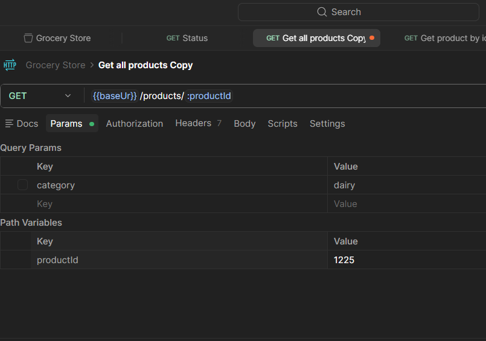

### Using colletctions
- To use postman properly it's necessary to store the requests. This is possible only if we use collections;
- Typically organized by API or use specific use case; ***I personally like to organize by a specific flow***
- Is postman we also use variables to store configurations. By doing that we use our time better because we don't have to change request by request if any main detail changes
- When working with variables pay attention to identify correctly what is to be shared or not;
- The postman response uses the JSON format
---------------------

### Query parameters
- It's a way to specify our request
- It will be displayed is postman like: `url?parameterkey=value`
>- Example: `https://simple-grocery-store-api.click/products?category=milk`
- The parameters must be detailed in the API documentation
- Most of the time will be case sensitive
- If I want to use more than one parameter the syntax will be: url?parameterkey=value`&name=xpto`
>- Example: ``https://simple-grocery-store-api.click/products?category=dairy&name=milk``

---

### Path variables
- It's a way to search for specific values
- The common notation would be: `https://simple-grocery-store-api.click/products/1223`
- In postman we can use the path variables:`https://simple-grocery-store-api.click/products/:productId`, where :productId will work like a variable with the value 1223   

- The difference between path variables and query parameters is that path variables are part of the path, while query parameters are a way to refine the endpoint